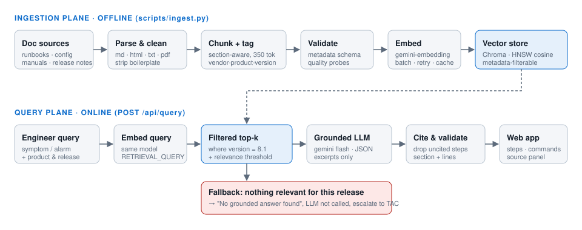

# NOC Copilot — Version-Aware Telecom Runbook RAG

> Kalvium Sprint 2 · Team project (3 members)
>
> **New to the project? Start with [docs/OVERVIEW.md](docs/OVERVIEW.md).**

**Problem.** A telecom operator maintains network configuration guides, troubleshooting runbooks
and vendor manuals, but support engineers cannot retrieve the precise resolution step during
outages, prolonging recovery.

**Solution.** A Retrieval-Augmented Generation (RAG) assistant. An engineer picks the equipment
and **software release**, describes the symptom or alarm, and gets the **exact resolution
steps and CLI commands for that release**. Every step cites the source document, section and
line range. If the documentation for that release does not cover the question, the assistant
says so instead of guessing.



## Why version-awareness matters

The same outage needs different commands on different releases. For example, resetting a BGP
session on an AX-9000 router:

| Release | Correct command |
| --- | --- |
| AuroraOS 7.4 | `clear ip bgp 10.0.0.2 soft` |
| AuroraOS 8.1 | `reset bgp neighbor 10.0.0.2 soft` (`clear ip bgp` was removed) |

Keyword search returns both answers, and an unfiltered RAG system may mix them. This system
stores `vendor / product / version` on every chunk and applies it as a **hard filter inside
the vector search**, so the model never sees another release's context.

## Architecture

| Plane | Steps | Code |
| --- | --- | --- |
| **Ingestion** (offline) | load → clean → chunk + tag → validate → embed → quality-check → index | `app/ingest/`, `scripts/ingest.py` |
| **Query** (online) | query + release → embed → version-filtered top-k → context → grounded JSON answer → citations | `app/rag.py`, `app/main.py` |

| Layer | Choice |
| --- | --- |
| LLM | Google Gemini `gemini-3.5-flash-lite` (falls back to `gemini-3.1-flash-lite` on 503/429): JSON-schema output, temperature 0.1 |
| Embeddings | `gemini-embedding-001` at 768 dimensions, asymmetric `RETRIEVAL_DOCUMENT` / `RETRIEVAL_QUERY` task types |
| Vector DB | ChromaDB (persistent), HNSW index with cosine distance, metadata filters on vendor/product/version/doc_type |
| Backend | FastAPI (`/api/query`, `/api/catalog`, `/api/health`) |
| Frontend | Plain HTML/CSS/JS: query box, answer view with copyable commands, source panel |

Key design decisions are documented in [docs/DESIGN.md](docs/DESIGN.md).

## Project structure

```
app/
  config.py          settings from .env
  tokens.py          token estimation + cost tracking
  embeddings.py      Gemini embedder (batching, retry/backoff, cache) + offline hash embedder
  vectorstore.py     Chroma collection design, version-filtered top-k, catalog
  llm.py             Gemini JSON-mode client
  rag.py             Workflow 2: grounded answer + citations + fallback
  main.py            FastAPI app
  prompts/           prompt templates (.md), kept separate from code
  ingest/            Workflow 1: loaders (md/html/txt/pdf), cleaning, chunking, pipeline
data/corpus/<vendor>/<product>/<version>/   documentation set (synthetic sample included)
eval/                golden question set + embedding probes
scripts/             ingest.py, ask.py, evaluate.py
tests/               offline pytest suite (no API key needed)
web/                 UI
docs/                PRD, design notes, team workflow, UX wireframe
```

## Getting started

Requires Python 3.11 or newer.

```bash
git clone <repo-url> && cd telecom-runbook-rag
python -m venv .venv
# Windows: .venv\Scripts\activate    macOS/Linux: source .venv/bin/activate
pip install -r requirements.txt
cp .env.example .env        # then put your key in GEMINI_API_KEY (https://aistudio.google.com/apikey)
```

Build the index (Workflow 1). This makes about 2 embedding calls and costs well under $0.01:

```bash
python scripts/ingest.py --dry-run   # validate + preview chunks, no API calls
python scripts/ingest.py             # embed and index
```

Run the app and open http://localhost:8000:

```bash
uvicorn app.main:app --reload
```

Ask from the terminal:

```bash
python scripts/ask.py "BGP peer is stuck in Idle, how do I reset it?" --product AX-9000 --version 8.1
```

Run the tests (offline) and the evaluation (uses the API):

```bash
pytest
python scripts/evaluate.py
```

## Adding documentation

Put files in `data/corpus/<vendor>/<product>/<version>/`. Markdown, HTML, TXT and PDF are
supported. Add front matter (`title`, `doc_type`, `url`) to Markdown and TXT files, `<meta>`
tags to HTML, and a `<file>.pdf.meta.yaml` sidecar to PDFs; see
[data/corpus/README.md](data/corpus/README.md). Then re-run `python scripts/ingest.py`.
Unchanged chunks come from the embedding cache, so re-ingestion costs nothing extra.

## Success metrics (from the PRD)

| Metric | Target | How we measure |
| --- | --- | --- |
| Answers with a correct source citation | ≥ 90% | `scripts/evaluate.py`: citation accuracy |
| Answers scoped to the correct version | ≥ 95% | `scripts/evaluate.py`: version scoping + trap questions |
| Median query response time | < 3 s | `scripts/evaluate.py`: median latency |
| Reduction in doc-related tickets | 50% | Post-launch, from `storage/query_log.jsonl` + ticket data |

Latest evaluation results are recorded in [docs/EVALUATION.md](docs/EVALUATION.md).

## Team & workflow

See [docs/TEAM_WORKFLOW.md](docs/TEAM_WORKFLOW.md) for branch naming, the PR process and the
work split.

## Disclaimer

The sample corpus is **synthetic**. "Aurora Networks" and "Helix Radio" are fictional vendors
invented for this demo; commands and URLs are made up.
